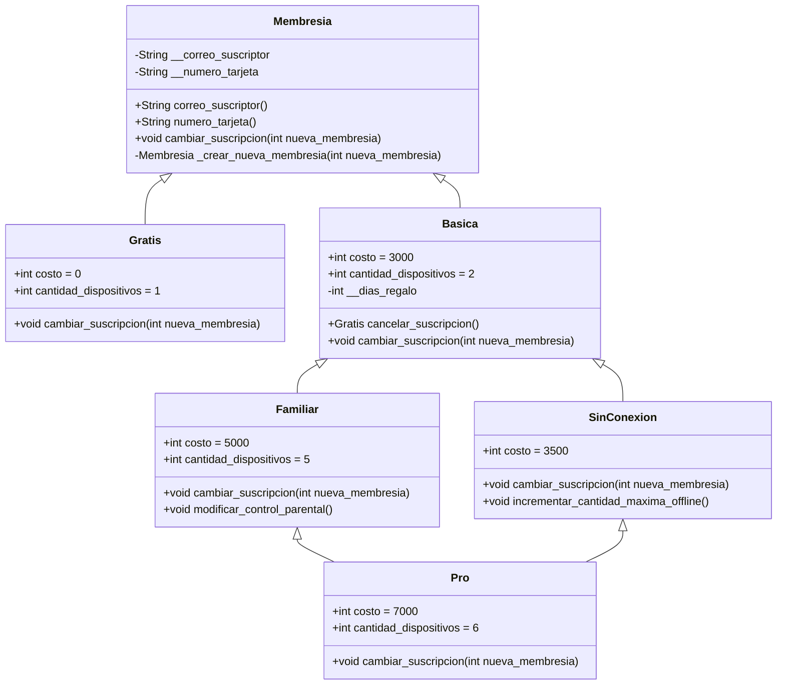

# Sistema de Membresías

Un sistema para gestionar diferentes tipos de membresías con características específicas, incluyendo membresías gratuitas, básicas, familiares, sin conexión y Pro.

## Descripción

Este proyecto es una implementación en Python para gestionar diferentes tipos de membresías con características y funcionalidades específicas. El sistema permite a los usuarios cambiar entre distintos tipos de membresía y realizar acciones como cancelar suscripciones o incrementar características específicas. Cada tipo de membresía tiene sus propios atributos y métodos.



### Principales Características

- **Membresía Gratuita**: Acceso básico sin costo.
- **Membresía Básica**: Acceso a características adicionales con un costo.
- **Membresía Familiar**: Permite el uso en varios dispositivos con características adicionales.
- **Membresía Sin Conexión**: Ofrece funcionalidades sin necesidad de estar en línea.
- **Membresía Pro**: La opción más completa con las mejores características.

## Insignias


## Empezando 🚀

Estas instrucciones te guiarán para obtener una copia de este proyecto en funcionamiento en tu máquina local para propósitos de desarrollo y pruebas.

### Prerrequisitos 📋

- **Sistema Operativo**: Cualquier sistema operativo compatible con Python.
- **Lenguaje de Programación**: Python 3.8 o superior.

### Instalación 🔧

Una guía paso a paso sobre cómo configurar el entorno de desarrollo e instalar todas las dependencias.

```bash
# Clona el repositorio
git clone https://github.com/tuusuario/tu-repositorio.git

# Navega al directorio del proyecto
cd tu-repositorio

# (Opcional) Crea un entorno virtual
python -m venv env
source env/bin/activate  # En Windows usa `env\Scripts\activate`
```

## Construido Con 🛠️

- [Python](https://www.python.org/) - El lenguaje utilizado

## Contribuyendo 🖇️

Las contribuciones son bienvenidas. Por favor, lee el [CONTRIBUTING.md](https://gist.github.com/brayandiazc/xxxxxx) para detalles sobre nuestro código de conducta y el proceso para enviar pull requests.

## Soporte

Si tienes algún problema o sugerencia, por favor abre un problema [aquí](https://github.com/tuusuario/tu-repositorio/issues).

## Versionado 📌

Usamos [Git](https://git-scm.com) para el versionado. Para las versiones disponibles, ve las [etiquetas en este repositorio](https://github.com/tuusuario/tu-repositorio/tags).

## Autores ✒️

- **Brayan Diaz C** - _Trabajo inicial_ - [Brayan Diaz C](https://github.com/brayandiazc)

Mira también la lista de [contribuidores](https://github.com/tuusuario/tu-repositorio/contributors) que han participado en este proyecto.

## Licencia 📄

Este proyecto está bajo la Licencia MIT - ve el archivo [LICENSE.md](LICENSE.md) para detalles.

## Expresiones de Gratitud 🎁

Estamos agradecidos por las contribuciones de la comunidad a este proyecto. Si encontraste valor en este proyecto o quieres contribuir, aquí está lo que puedes hacer:

- Comparte este proyecto con otros
- Invítanos un café ☕
- Inicia un nuevo problema o contribuye con un PR
- Muestra tu agradecimiento diciendo gracias en un nuevo problema.

---

⌨️ con ❤️ por [Brayan Diaz C](https://github.com/brayandiazc) 😊
